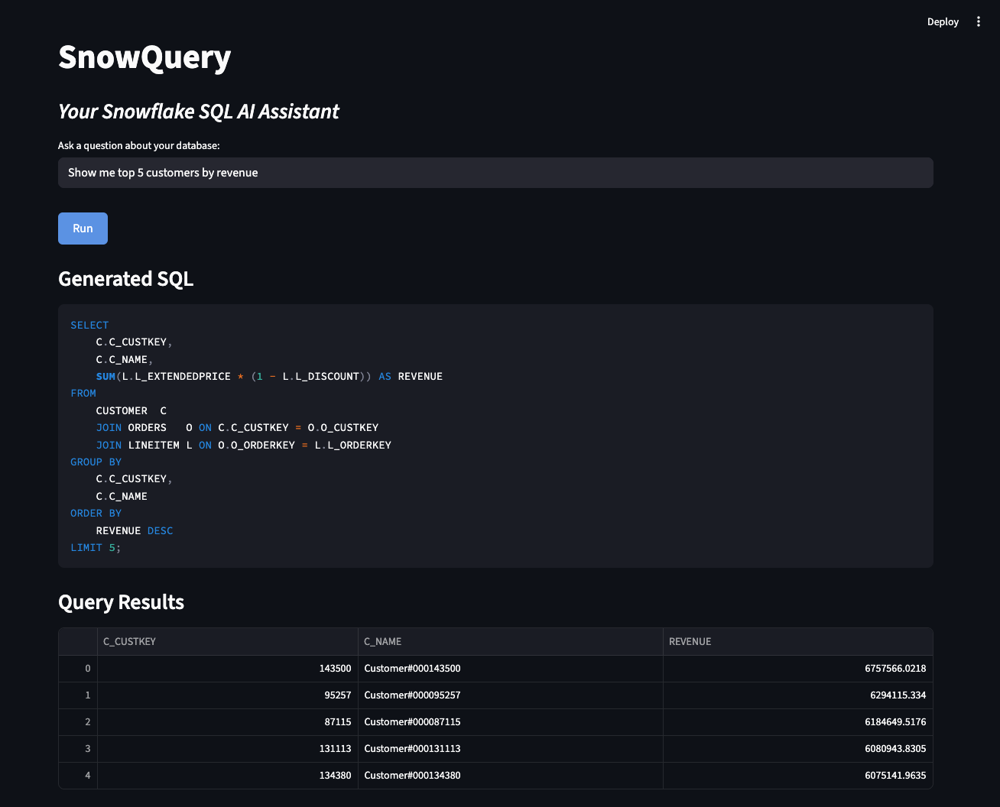

# SnowQuery

An AI-powered assistant that turns natural language into Snowflake queries using MCP and agentic reasoning.



## Project directory setup

```
SnowQuery/
│── src/
│ ├── agent.py # Main agent logic (MCP + LLM + orchestration)
│ ├── snowflake_client.py # Connects & queries Snowflake
│ ├── mcp_context.py # MCP integration (schemas, metadata provider)
│ └── app.py # CLI or Streamlit web interface
│
│── requirements.txt # deps (snowflake-connector-python, openai, streamlit, mcp)
|–– .env # Snowflake + API credentials (you will need to create this file to run SnowQuery––sorry, credits cost $$$)
│── README.md
```

## Setup

1. **Clone the repository**

```bash
git clone https://github.com/EdanStasiuk/SnowQuery.git
cd SnowQuery/src
```

2. **Create a virtual environment (recommended)**

```bash
python3 -m venv .venv
source .venv/bin/activate   # Linux/macOS
.venv\Scripts\activate      # Windows
```

3. **Install dependencies**

```bash
pip install -r requirements.txt
```

4. **Create a `.env` file in `src/` with your credentials**

```ini
SNOWFLAKE_ACCOUNT=<your_account>
SNOWFLAKE_USER=<your_user>
SNOWFLAKE_PASSWORD=<your_password>
SNOWFLAKE_WAREHOUSE=<your_warehouse>
SNOWFLAKE_DATABASE=<your_database>
SNOWFLAKE_SCHEMA=<your_schema>
OPENAI_API_KEY=<your_openai_key>
```

> ⚠️ Using SnowQuery with OpenAI API will consume credits.

## How to Use

### CLI Mode

Run SnowQuery directly from the terminal:

```bash
python3 app.py "<Enter your prompt here>"
```

**Example:**

```bash
python3 app.py "Show me top 5 customers by revenue"
```

- Outputs the generated SQL
- Displays query results in tabular form

### Web Interface (Streamlit)

Launch the interactive web app:

```bash
streamlit run app.py
```

- Enter your natural language query in the text box
- Click **Run** to generate SQL and fetch results
- View results in a table and visualize using interactive charts

**Features:**

- Select which columns to plot on the X and Y axes
- Choose chart type: Bar, Line, Scatter
- Interactive tooltips for all data columns
- Resilient querying with retry logic for Snowflake

---

## Notes

- Streamlit requires Python 3.8+
- Ensure your Snowflake credentials are correct and that the schema exists

---
